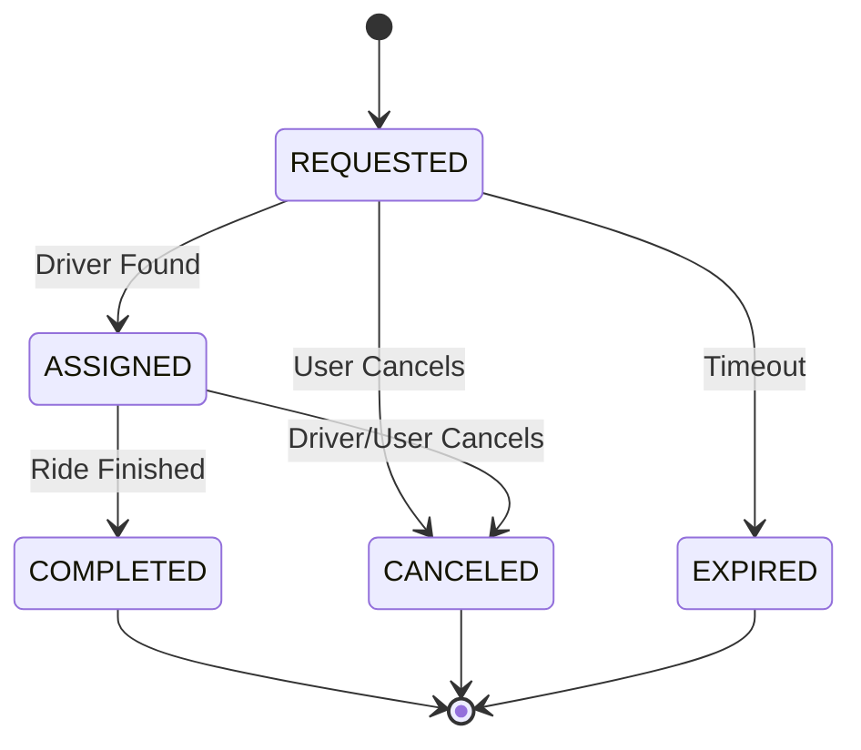

# Trip Service - Scenario Documentation

The Trip Service is the core orchestrator of the ride-hailing lifecycle. It manages the state of every ride request and integrates with the Matching Service via Kafka.

## Core Scenarios

### 1. Trip Request (`POST /api/v1/trips`)
- **Action:** User sends pickup and dropoff coordinates.
- **Workflow:**
  - Validates user input.
  - Persists trip with status `REQUESTED`.
  - Publishes `trip.requested` event to Kafka.
- **Expected Outcome:** User receives `201 Created` with a Trip ID.

### 2. Driver Assignment (Event-Driven)
- **Action:** `matching-service` finds a driver and publishes `driver.assigned`.
- **Workflow:**
  - `AssignmentConsumer` listens to the event.
  - Updates Trip status to `ASSIGNED`.
  - Links Trip to the `driverId`.
- **Expected Outcome:** Trip details now include the driver's info.

### 3. Trip Completion (`POST /api/v1/trips/{id}/complete`)
- **Action:** Driver signals the trip is finished.
- **Workflow:**
  - Updates status to `COMPLETED`.
  - (Future) Triggers payment processing.
- **Expected Outcome:** Ride is archived as successful.

### 4. Trip Cancellation (`POST /api/v1/trips/{id}/cancel`)
- **Action:** User or Driver cancels the ride.
- **Workflow:**
  - Updates status to `CANCELED`.
  - Publishes `trip.canceled` to release the driver (if assigned).
- **Expected Outcome:** Dynamic cleanup of active resources.

### 5. No Driver Found (Timeout)
- **Action:** System fails to find a driver within 5 minutes.
- **Workflow:**
  - Scheduled task or matching failure event.
  - Updates status to `EXPIRED`.
- **Expected Outcome:** User is notified to try again later.

## State Machine

